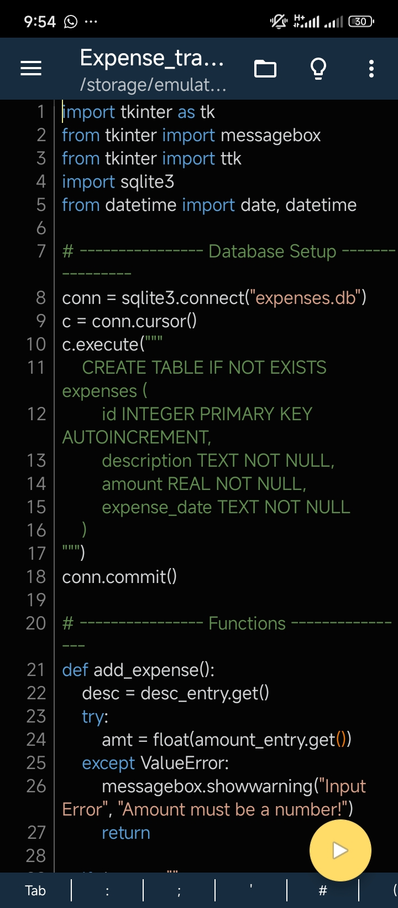

# 📅 Expense Tracker  

A simple **Python Expense Tracker** built with **Tkinter (GUI)** and **SQLite (database)**.  
This project was developed as part of **Week 5** in my AI learning journey.  

It allows users to:  
- Add expenses with a description, amount, and custom date  
- View expenses for **Today**, **All**, or a **specific date**  
- Delete expenses from the list  
- Automatically calculate and display the total spent  
- Use scrollable lists for easy navigation of records  

---

## 🚀 Features  

✅ Add expenses with description and amount  
✅ Store data permanently using SQLite  
✅ Filter expenses by **Today**, **All**, or a **Custom Date**  
✅ Auto-numbering for expense entries  
✅ Display total expenses dynamically  
✅ Scrollbars for handling long records  
✅ Clean Tkinter-based GUI  

---

## 🛠️ Tech Stack  

- **Language**: Python 3.x  
- **GUI**: Tkinter  
- **Database**: SQLite3  

---

## 📸 Screenshots  

  
  

---

## 📖 About This Project  

This project was a bit challenging because of:  
- Debugging the **date filter**, where past expenses were showing up in the wrong date view  
- Fixing the **entry numbering system**, so every date view starts from `1` instead of continuing  
- Handling scrollbars for long expense lists  

Working through these bugs gave me hands-on practice in debugging and improving my Python + Tkinter skills.  

---

## 🔮 Next Steps  

This will be my **last Python project** before moving into **Data Science & AI development**, which includes:  
- Linear Algebra  
- Statistics for AI  
- Vectors & Matrices  
- NumPy & Pandas  
- Matplotlib & Data Visualization  

---

## 🏆 Learning Outcome  

This project strengthened my understanding of:  
- Working with **SQLite databases in Python**  
- Building **interactive GUIs with Tkinter**  
- Implementing **filters and dynamic lists**  
- Debugging and testing projects for real-world use  

---

## 📂 Project Structure

expense-tracker/
│
├── expenses.db            # SQLite database (auto-created when app runs)
├── expense_tracker.py     # Main application file (Tkinter + SQLite logic)
├── screenshots/           # Folder containing project screenshots
│   ├── add_expense.jpg
│   ├── view_expenses.jpg
│   └── delete_expense.jpg
└── README.md              # Project documentation

---

## ⚡ How to Run  

1. Clone this repository:  
   ```bash
   git clone https://github.com/ToboreOghen/Expense-tracker.git
   cd Expense-tracker
   python expense_tracker.py
